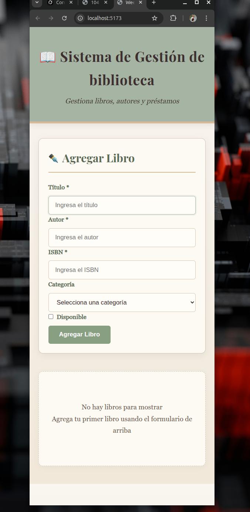

# 📚 Sistema de Gestión de Biblioteca - Libros Usados

**Proyecto Semana 2** – Bootcamp React + TypeScript + Vite

Aplicación CRUD completa para gestionar un catálogo de **libros usados** en una biblioteca: agregar nuevos libros, editar información existente, eliminar registros y visualizar la lista completa.

### Características implementadas

- Formulario controlado para **agregar** y **editar** libros (título, autor, ISBN, categoría, disponible)
- Validación básica de campos obligatorios (título, autor, ISBN) con alertas
- Pre-llenado automático del formulario al editar un libro
- Botón "Cancelar" solo visible en modo edición
- Lista de libros con tarjetas individuales (ItemCard)
- Operaciones CRUD completas: Create, Read, Update, Delete
- Estado vacío bonito con mensaje motivador
- Diseño inspirado en biblioteca clásica (tonos tierra claros, pergamino, verde oliva suave, bordes dorados)
- Responsive básico (media queries)
- TypeScript estricto + interfaces tipadas en todos los componentes

### Tecnologías

- React 18 + TypeScript
- Vite (build tool)
- CSS puro (sin frameworks)
- React Hooks: `useState`, `useEffect`
- Fuentes: Playfair Display (títulos) + Georgia (texto)

### Estructura del proyecto
src/
├── components/
│   ├── Header.tsx              # Título y descripción de la biblioteca
│   ├── ItemForm.tsx            # Formulario agregar/editar libro
│   ├── ItemList.tsx            # Lista + empty state
│   └── ItemCard.tsx            # Tarjeta individual de cada libro
├── types/
│   └── index.ts                # Interfaces: Item, ItemFormProps, etc.
├── App.tsx                     # Componente raíz + estado global
└── main.tsx
text


### Instalación y ejecución

1. Clona el repositorio
```bash
git clone <tu-repo-url>
cd <nombre-proyecto>

2. Instala dependencias
pnpm install

3. Ejecuta en desarrollo
pnpm dev

Abre http://localhost:5173
Cómo usar

En el formulario superior agrega un libro (título, autor e ISBN son obligatorios)
El libro aparece en la lista debajo
Haz clic en Editar → el formulario se pre-llena automáticamente
Modifica y presiona Actualizar Libro
Usa Cancelar para volver al modo agregar sin guardar
Usa Eliminar para quitar un libro
